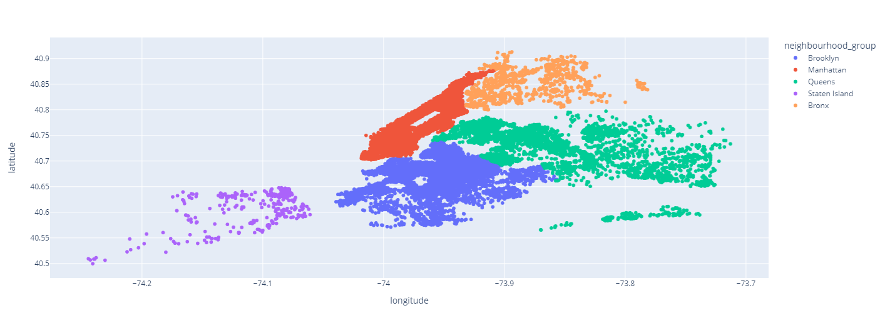

# Predicting Airbnb Prices in New York City using Ensemble Machine Learning

## Introduction
Airbnb is an online marketplace for arranging lodging, primarily homestays, or tourism experiences. As of 2019, the platform had over 150 million registered users worldwide, and over 7 million listings in more than 220 countries and regions. However, the prices of the listings are not always consistent with their actual value. In this project, we will use ensemble machine learning to predict the prices of Airbnb listings in New York City.

## Data
We will use the publicly available New York City Airbnb Open Data from Kaggle. The dataset includes information about Airbnb listings in New York City from 2019, including listing ID, host ID, host name, neighbourhood group, neighbourhood, latitude, longitude, room type, price, minimum nights, number of reviews, and more. The dataset has 48,895 rows and 16 columns.

## Packages to Download
Required packages: pandas, math, numpy, matplotlib, seaborn, sklearn, sklearn.tree.DecisionTreeRegressor, sklearn.ensemble.BaggingRegressor, sklearn.ensemble.RandomForestRegressor, sklearn.ensemble.GradientBoostingRegressor, sklearn.ensemble.ExtraTreesRegressor, sklearn.ensemble.StackingRegressor, sklearn.metrics.mean_squared_error, sklearn.metrics.r2_score, sklearn.metrics.mean_absolute_error, sklearn.metrics.mean_absolute_percentage_error, sklearn.metrics.explained_variance_score, sklearn.model_selection.train_test_split, sklearn.model_selection.RandomizedSearchCV, sklearn.model_selection.KFold, sklearn.model_selection.GridSearchCV, sklearn.tree.plot_tree, sklearn.inspection.permutation_importance, time, xgboost, catboost.CatBoostRegressor, sklearn.inspection.permutation_importance

## Methodology
We will use ensemble machine learning to predict the prices of Airbnb listings in New York City. Ensemble machine learning is a technique that combines multiple models to improve the accuracy of the predictions. We will use the following ensemble methods:

* Random Forest: a decision tree-based ensemble method that combines multiple decision trees to improve the accuracy of the predictions.

* Extra Random Forest: A variant of Random Forest that adds an extra level of randomness to the model by randomly selecting subsets of features and thresholds for each split. This helps to reduce overfitting and improve the generalization performance of the model.

* Gradient Boosting: a machine learning technique that combines multiple weak models to create a strong model.

* XGBoost: an implementation of gradient boosting that is optimized for speed and performance.

* CatBoost: a gradient boosting library that is optimized for categorical features.

* AdaBoost: A boosting algorithm that combines multiple weak classifiers to create a strong classifier. 

* Stacking: Ccombines multiple models by training a meta-model on their predictions. It can improve the accuracy of the predictions by leveraging the strengths of different models and reducing their weaknesses.

We will use the following steps:

1. Load the dataset and preprocess the data by removing unnecessary columns, encoding categorical variables, and splitting the data into training and testing sets.

2. Train the models using the training data.

3. Evaluate the models using the testing data.

4. Compare the performance of the models and choose the best one.

5. Use the best model to predict the prices of new Airbnb listings.

## Results
We will present the results of our analysis in the following ways:

1. Model Performance: We will evaluate the performance of the models using the root mean squared error (RMSE), which measures the difference between the predicted and actual values. We will present the RMSE for each model and compare their performance.

2. Feature Importance: We will analyze the feature importance of the models to determine which variables are most important in predicting the prices of Airbnb listings.

3. Predictions: We will use the best model to predict the prices of new Airbnb listings in New York City.

The results can be seen in the following table:

 | Model                         |  MSE   | RMSE  | $R^2$ |
 | ----------------------------- |------- |------ |------ |
 | Regression Tree from Scratch  | n/a    | 0.434 | 0.597 |
 | Regression Tree               | 0.176  | 0.419 | 0.596 |
 | Bagging                       | 0.153  | 0.391 | 0.649 |
 | Random Forest                 | 0.168  | 0.410 | 0.613 |
 | Extra Random Forest           | 0.155  | 0.394 | 0.644 |
 | Gradient Boosting             | 0.151  | 0.389 | 0.653 |
 | CatBoost                      | 0.152  | 0.390 | 0.651 |
 | XGBoost                       | 0.151  | 0.388 | 0.654 |
 | ADABoost with DT              | 0.166  | 0.408 | 0.618 |
 | ADABoost with CatBoost        | 0.153  | 0.391 | 0.648 |
 | ADABoost with XGBoost         | 0.151  | 0.389 | 0.653 |
 | Stacking                      | 0.151  | 0.387 | 0.656 |

## Conclusion
In this project, we used ensemble machine learning to predict the prices of Airbnb listings in New York City. We evaluated the performance of various ensemble methods, including random forest, gradient boosting, XGBoost, and CatBoost. We also analyzed the feature importance of the models to determine which variables are most important in predicting the prices of Airbnb listings. Finally, we stacked the best models together to predict the prices of new Airbnb listings in New York City.

